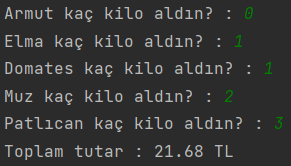

# Java Manav Kasa Ödevi

## Açıklama

* Bu proje [patika.dev](https://patika.dev) web sitesindeki java eğitimindeki manav kasa ödevidir.
* Ödevde **armut**, **elma**, **domates**, **muz** ve **patlıcan**ın tutarları web sitesinde verilen şekilde sırasıyla 2.14, 3.67, 1.11, 0.95 ve 5.00 TL alınmıştır.

---

## Ekran Görüntüsü
